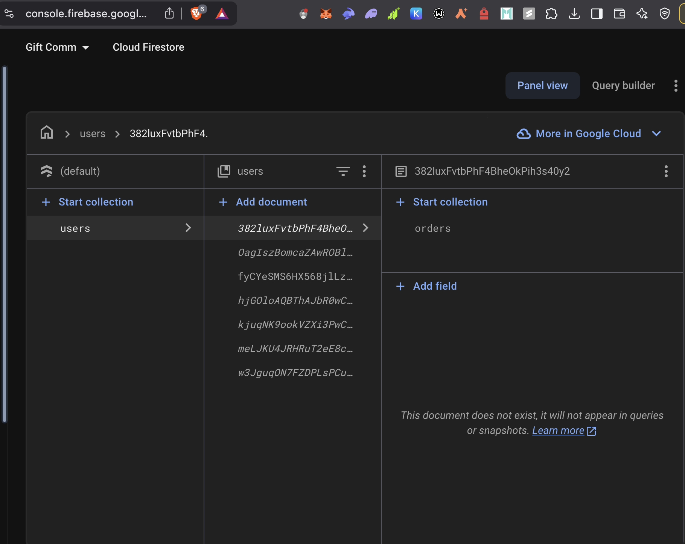
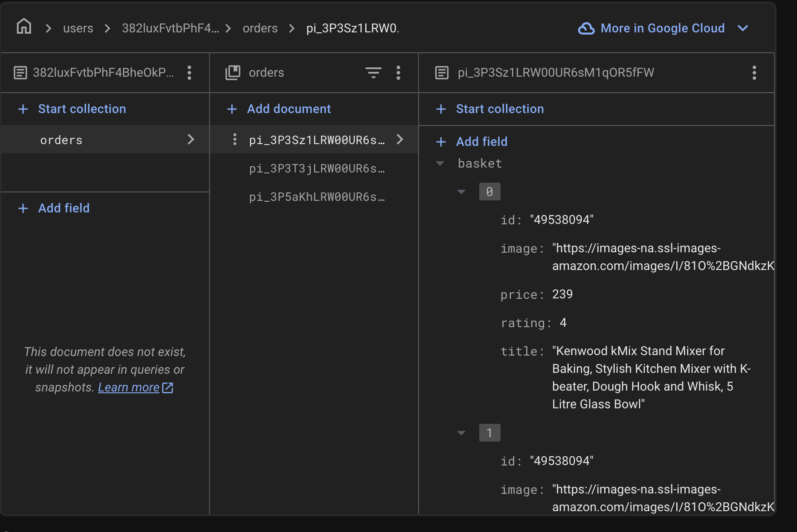
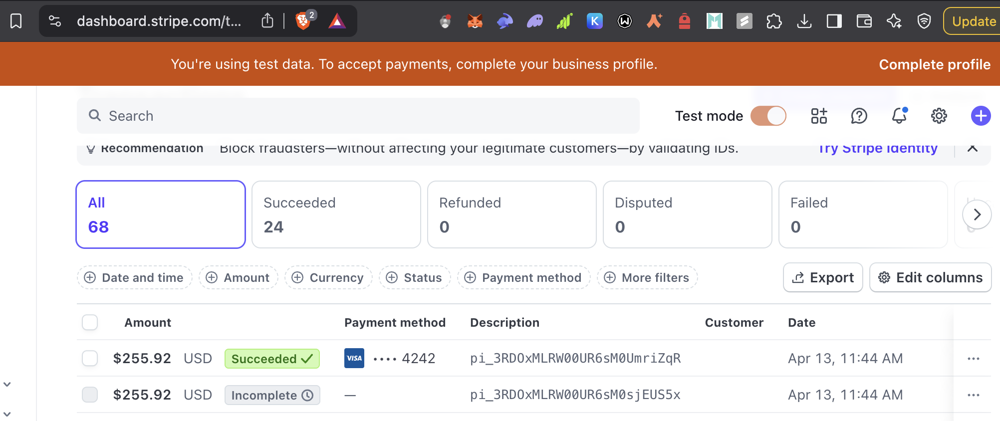
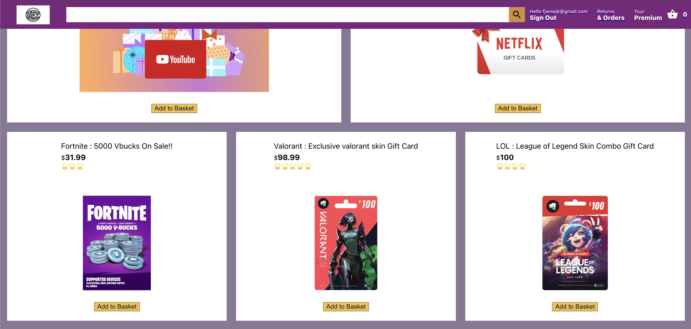
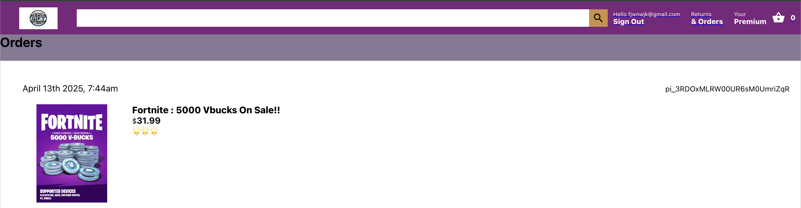
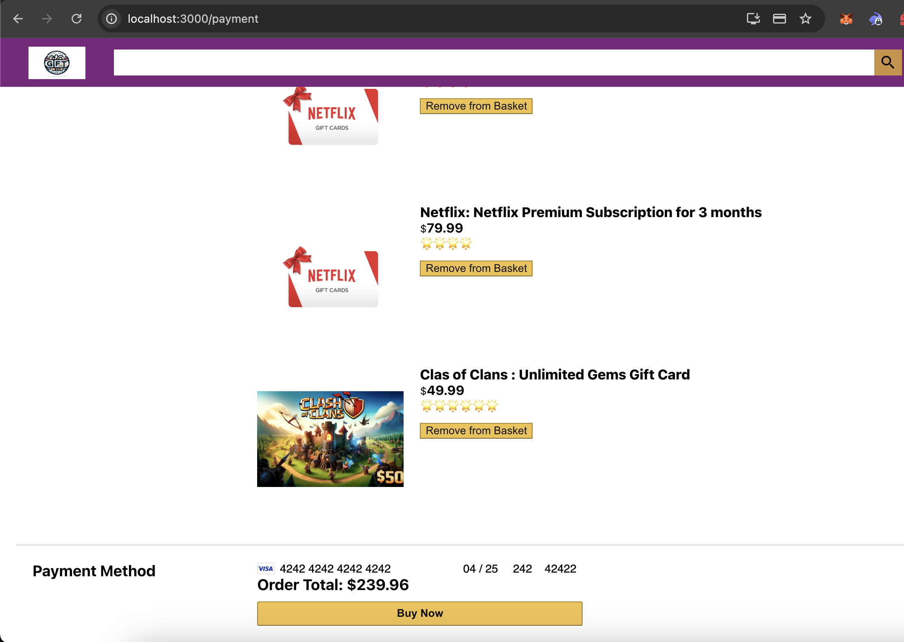

# GIFtdotcom - Online Gift Card Store


GIFtdotcom is a full-featured e-commerce platform specializing in digital gift cards for popular games and services. Built with React, Redux, Firebase, and Stripe, this application provides end-to-end functionality from browsing products to secure checkout and payment processing.

## Features

- **User Authentication**: Secure login and registration using Firebase Authentication
- **Product Browsing**: Browse through various gift cards from popular platforms
- **Shopping Cart**: Add and remove items from your shopping cart
- **Order History**: View your past orders and purchase details
- **Secure Payments**: Process payments securely using Stripe integration
- **Responsive Design**: Fully responsive interface that works on desktop and mobile devices

## Tech Stack

- **Frontend**: React.js with Redux for state management
- **UI Components**: Material UI
- **Authentication**: Firebase Authentication
- **Database**: Firebase Firestore
- **Payment Processing**: Stripe
- **Hosting**: Firebase Hosting
- **Backend Functions**: Firebase Cloud Functions

## Installation and Setup

### Prerequisites

- Node.js (v14 or higher)
- npm or yarn
- Firebase CLI (`npm install -g firebase-tools`)
- A Firebase project
- A Stripe account

### Getting Started

1. Clone the repository:
   ```
   git clone https://github.com/Prithvicy/Giftdotcom.git
   cd Giftdotcom
   ```

2. Install dependencies in the main project directory:
   ```
   npm install
   ```

3. Install dependencies in the functions folder:
   ```
   cd functions
   npm install
   cd ..
   ```

4. Start the Firebase emulators for local development:
   ```
   cd functions
   firebase emulators:start
   ```

5. In a new terminal, start the React development server:
   ```
   cd ..  # Make sure you're in the main project directory
   npm start
   ```

6. Open your browser and navigate to `http://localhost:3000` to see the application running.

## Project Structure

- `/src`: Contains all React components and application logic
  - `/src/components`: UI components
  - `/src/pages`: Page components
  - `/src/redux`: Redux store, actions, and reducers
  - `/src/firebase.js`: Firebase configuration
  - `/src/App.js`: Main application component
- `/functions`: Contains Firebase Cloud Functions for backend operations
- `/public`: Static assets and HTML template

## Deployment

To deploy the application to Firebase Hosting:

1. Build the React application:
   ```
   npm run build
   ```

2. Deploy to Firebase:
   ```
   firebase deploy
   ```

## Contributing

Contributions are welcome! Please feel free to submit a Pull Request.

## License

This project is licensed under the MIT License - see the LICENSE file for details.

## Acknowledgements

- React.js
- Firebase
- Stripe
- Material UI
## Database

**Firestore Diagrams:**




---

## Payments

**Stripe Payment Dashboard:**



---

## Outputs

**Home Screen:**



**Orders Screen:**



**Payment Screen:**

